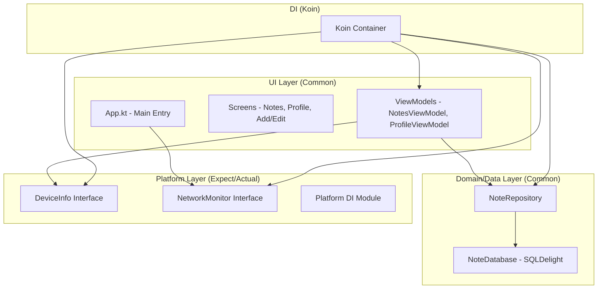

# MyProfile & Notes App - Kotlin Multiplatform

Aplikasi manajemen catatan (Notes App) ini merupakan pengembangan lanjutan berbasis **Compose Multiplatform** yang kini mengimplementasikan **Dependency Injection menggunakan Koin** untuk mengelola seluruh dependensi aplikasi secara terstruktur. Aplikasi tetap menggunakan **SQLDelight** dengan pendekatan *offline-first* serta mendukung fitur utama seperti **CRUD**, **pencarian**, dan **pengaturan** dengan **DataStore**. Selain itu, ditambahkan fitur **Device Info** dan **Network Monitor** berbasis *expect/actual* untuk mendukung multiplatform, yang ditampilkan pada halaman Settings dan indikator status jaringan di halaman utama. Dengan arsitektur **MVVM** dan pengelolaan **UI state** yang baik, aplikasi menjadi lebih modular, responsif, dan siap digunakan di berbagai platform.

## Fitur

1. **Dependency Injection Koin**: Seluruh aplikasi telah dimigrasikan menggunakan Koin untuk Dependency Injection. Semua komponen (Repository, ViewModel, dan layanan platform) kini dikelola dan di-*inject* melalui Koin.
2. **DeviceInfo Multiplatform**: Implementasi `DeviceInfo` menggunakan `expect/actual` untuk mendapatkan informasi perangkat seperti nama device, sistem operasi, dan versi pada Android, iOS, JVM, dan Web.
3. **NetworkMonitor Real-time**: Implementasi `NetworkMonitor` menggunakan `expect/actual` untuk memantau status koneksi internet secara real-time.
4. **Integrasi Settings**: Informasi perangkat ditampilkan secara dinamis pada halaman Profile/Settings.
5. **Indikator Status Jaringan**: Indikator "Mode Offline" akan muncul di halaman utama ketika perangkat kehilangan koneksi internet.
6. **ViewModel dengan Koin**: ViewModel disediakan menggunakan `koinViewModel()` dari library `io.insert-koin:koin-compose-viewmodel`.

## Architecture Diagram

Aplikasi ini menggunakan pendekatan Arsitektur Bersih dengan Koin sebagai kontainer Injeksi Ketergantungan utama.

## Tech Stack

-   **UI Framework**: [Compose Multiplatform](https://www.jetbrains.com/lp/compose-multiplatform/)
-   **Dependency Injection**: [Koin 4.0.0](https://insert-koin.io/)
-   **Database**: [SQLDelight](https://cashapp.github.io/sqldelight/)
-   **Navigation**: [Jetpack Navigation Compose](https://developer.android.com/jetpack/compose/navigation)

## Cara Menjalankan Project

1. **Persiapan Resource**: Pastikan file `profile_user.png` berada di folder `composeApp/src/commonMain/composeResources/drawable/`.
2. **Sync Project**: Lakukan *Gradle Sync* di Android Studio.
3. **Run**:
   - Untuk Android: Pilih modul `composeApp` lalu klik **Run**.
   - Untuk Desktop: Jalankan perintah `./gradlew :composeApp:run` di terminal.

## Dokumentasi Visual

| Device Info (Settings) | Network Indicator (Offline) |
| :---: | :---: |
| |  |

## Video Demo
Video demo fitur aplikasi dapat diakses melalui tautan berikut : https://youtube.com/shorts/Eypx0dphVhA?si=yh4oL_Qskx9HwC2l

---
